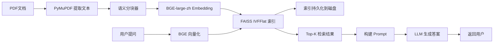

## 用户需求

按方案 A 执行：先实现真实的 RAG/FAISS 功能代码，再更新 README。纯增量式开发，不修改任何现有业务逻辑代码。

### RAG 智能检索功能

- 支持对已上传的 PDF 文档进行自然语言问答
- 后端实现完整的 RAG 链路：文档分块 → Embedding 向量化 → FAISS 索引 → 检索 → LLM 生成答案
- 前端提供聊天式问答界面，可切换文档、展示检索来源

### README 重构

- 项目简介加入 "RAG 检索" 和 "自然语言查询" 关键词
- 新增 "RAG 智能检索模块" 章节（含检索流程图、技术实现表格、FAISS 索引配置代码、性能指标表格）
- 修改技术栈表格，增加 FAISS 向量检索行
- 末尾新增专利号 ZL202410552139.0

## 技术栈

| 类别 | 技术 | 用途 |
| --- | --- | --- |
| 文档解析 | PyMuPDF（已有） | 提取 PDF 文本 |
| 语义分块 | 自定义滑动窗口 | 按段落边界切分，重叠保留上下文 |
| Embedding | sentence-transformers + BGE-large-zh | 中文向量化，768 维 |
| 向量检索 | FAISS (IndexIVFFlat) | IVF1024 聚类，nprobe=16，召回 Top-K |
| 生成 | OpenAI 兼容 API（复用现有火山引擎 DeepSeek） | 基于检索结果生成答案 |
| 后端 | Flask + Blueprint | REST API |
| 前端 | Vue 3 + Element Plus | 聊天问答界面 |


## 实现方案

### 整体策略

在现有 Flask Blueprint 架构上追加一个独立的 `rag_bp` 蓝图，不修改任何现有蓝图或业务逻辑。RAG 服务层独立封装，通过复用现有 PyMuPDF 和 LLM Client 实现文档加载与答案生成，新增 sentence-transformers 和 FAISS 完成向量化与检索。

### 核心数据流



### 后端架构

```
backend/
├── services/
│   └── rag_service.py          # [NEW] RAG 核心服务
│       ├── RagDocumentLoader   # 文档加载（复用 PyMuPDF）
│       ├── SemanticChunker     # 语义分块（滑动窗口+段落边界）
│       ├── EmbeddingService    # 向量化（sentence-transformers）
│       ├── FaissIndexManager   # FAISS 索引管理（构建/加载/检索）
│       └── RagPipeline         # 管线编排（加载→分块→索引→检索→生成）
├── api/
│   └── rag_api.py              # [NEW] RAG API Blueprint
│       ├── POST /api/rag/build-index   # 为指定文档构建索引
│       ├── POST /api/rag/query         # 提出问题并获取答案
│       └── GET  /api/rag/stats         # 获取索引统计信息
└── app.py                       # [MODIFY] 追加 rag_bp 注册
```

### 前端架构

```
frontend/src/
├── api/
│   └── rag.js                  # [NEW] RAG API 调用封装
├── views/
│   └── RagChatPage.vue         # [NEW] 问答聊天页面
│       ├── 左侧：文档选择面板
│       ├── 中间：对话消息流（用户消息+AI回复+来源引用）
│       └── 底部：输入框 + 发送按钮
├── router/
│   └── index.js                # [MODIFY] 追加 /rag-chat 路由
└── App.vue                     # [MODIFY] 导航栏追加"智能问答"按钮
```

### 关键性能设计

- **FAISS IndexIVFFlat**：1024 个聚类中心，训练后 nprobe=16 平衡速度与召回
- **索引持久化**：构建后保存为 `.faiss` 文件，重启后直接加载无需重建
- **Embedding 缓存**：相同文本不重复编码，减少 GPU/CPU 开销
- **流式响应**：前端使用 SSE 或分块返回，提升交互体验

## 设计风格

采用现代简约 + 对话式 UI 风格，与现有 Element Plus 项目风格无缝融合。页面为经典三栏布局：左侧文档选择面板、中间聊天消息流、右侧可展开的检索结果详情。

### 页面布局（单页 RagChatPage.vue）

**顶部导航栏**（复用 App.vue 现有导航，追加"智能问答"按钮）：

- 风格与现有"数据解析""数据审核""会计勾稽"等按钮完全一致
- 使用 `el-button type="info"` 或自定义蓝色调，区分于其他功能

**左侧文档选择面板（宽度 260px，可折叠）**：

- 展示已上传并已解析的 PDF 文档列表
- 每项显示文档名称 + 索引状态标签（已索引/未索引）
- 选中的文档高亮，切换文档时自动加载对应索引
- 底部有"构建索引"按钮，点击触发索引构建

**中间对话区域（弹性宽度）**：

- 顶部标题栏显示当前文档名称
- 消息流区域：用户消息靠右（蓝色气泡），AI 回复靠左（灰色气泡）
- AI 回复气泡内嵌检索来源引用（可展开查看原文片段）
- 支持 Markdown 渲染（表格、列表、加粗等）
- 新消息自动滚动到底部，加载历史时保持位置
- 打字机效果：AI 回复逐字显示

**底部输入区**：

- 多行输入框（el-input type="textarea"），支持 Shift+Enter 换行
- 发送按钮（el-button type="primary"），也支持 Enter 直接发送
- 左侧有清除对话按钮
- 加载中显示发送按钮为 loading 状态

**右侧详情面板（宽度 320px，默认隐藏，点击来源引用时展开）**：

- 展示当前引用的检索片段原文
- 标注相似度分数
- 高亮匹配关键词