# BankDataViz | DocBrain
> 智能文档解析 · RAG 问答 · 数据分析与可视化平台

> 从 PDF/图片中自动提取表格数据，支持结构化导出、规则校验、可视化分析及 RAG 智能问答。以银行年报数据为行业应用案例，底层引擎可适配任意行业文档。

> **演示模式**：启动后无需登录，系统自动注入管理员权限，可直接体验全部功能。

---

## Overview

```
PDF/图片 → [表格检测] → [OCR识别] → [LLM表头分析] → [8步重构] → [结构化Excel] → [会计勾稽校验]
                 ↓                                    ↑                    ↓
          三通道召回+NMS                         动态列匹配降级              三类规则引擎
```

**代码规模**：442+ 次提交，140+ Python 模块，14 个 API 蓝图，48+ Vue 组件，15+ 设计模式实例

---

## 项目结构

```
BankDataViz/
├── backend/                    # Python 后端
│   ├── api/                    # 15+ API 蓝图（文件上传/转换/审核/LLM/RAG/Harness...）
│   ├── harness/                # Agent 编排层（Tool 包装 + Agent 定义）
│   │   ├── tools/              # 5 个标准化 Tool（OCR/LLM分析/重建/审计/RAG）
│   │   └── agents/             # TableParsingAgent（组合 OCR→LLM→重建）
│   ├── core/                   # 核心管线（表格检测→OCR→LLM→重构）
│   │   └── table_processor/    # 8 步表格重构引擎（~2400 行）
│   ├── services/               # 服务层（勾稽引擎、检测器、缓存管理）
│   ├── database/               # 数据库层（适配器模式、迁移管理）
│   ├── tests/harness/          # 集成测试套件（数据仓库 CRUD + 服务层测试）
│   └── models/                 # SQLAlchemy 数据模型
├── frontend/                   # Vue 3 前端
│   ├── src/
│   │   ├── views/              # 9 个页面（解析/审核/看板/勾稽/问答/Prompt...）
│   │   ├── components/         # 48+ 组件（excel/common/threecolumns/layout）
│   │   ├── stores/             # 7 个 Pinia Store（auth/search/bankData/...）
│   │   ├── composables/        # 可组合函数库
│   │   ├── api/                # API 调用封装
│   │   └── router/             # 路由与权限守卫
│   └── package.json
├── docs/screenshots/           # 功能截图（11 张，全流程覆盖）
└── scripts/                    # 辅助脚本
```

---

## 功能演示

> 基于建设银行 2024 年报的真实数据展示，完整覆盖「上传→检测→解析→审核→校验→识别→看板→问答」全流程。

### 1. PDF 上传与分类

上传 PDF 后，系统自动识别页面类型（文本型/扫描件），并对扫描件进行三通道表格检测（YOLOv8 + 线条分析 + 文本聚类）。

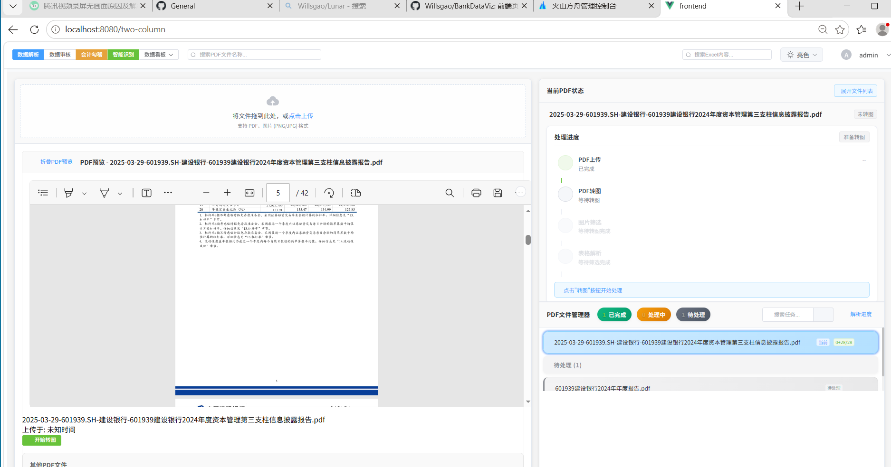
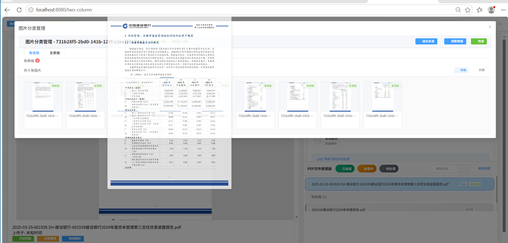

### 2. 表格数据提取

对文本型 PDF 使用 PyMuPDF 坐标提取，对扫描件使用豆包 API 视觉识别，提取表格内容并展示在界面中。

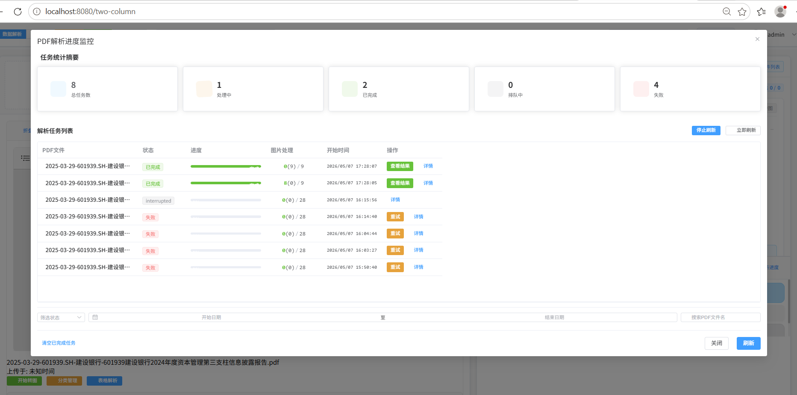

### 3. 数据审核与校对

支持在界面中直接编辑表格数据，自动保存修改，支持 undo/redo。

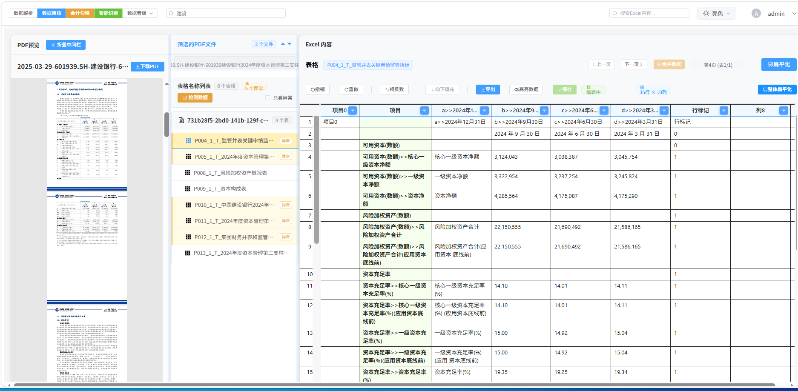

### 4. 数据导出与转换

一键将解析结果导出为结构化 Excel，支持多 sheet 打包下载。

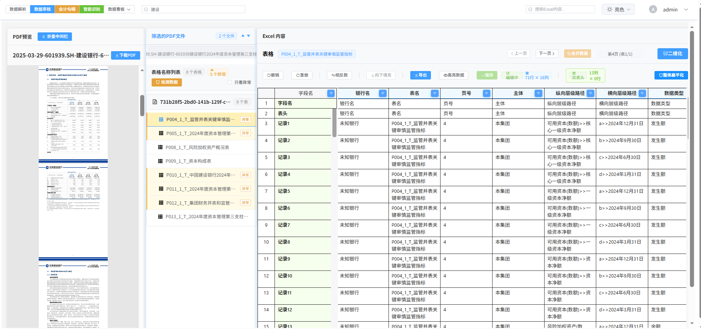

### 5. 会计勾稽自动化校验

配置银行财务指标校验规则，系统自动定位报表数据、执行公式计算、输出校验结果。

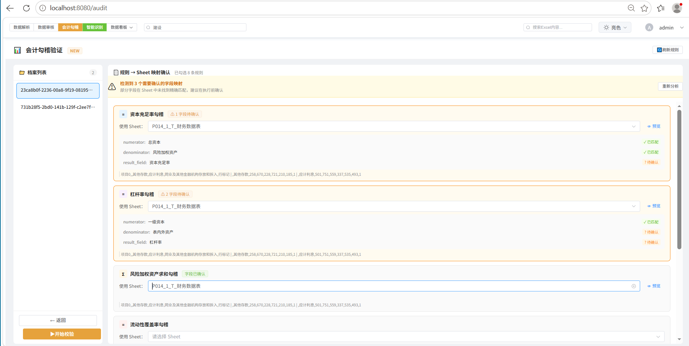
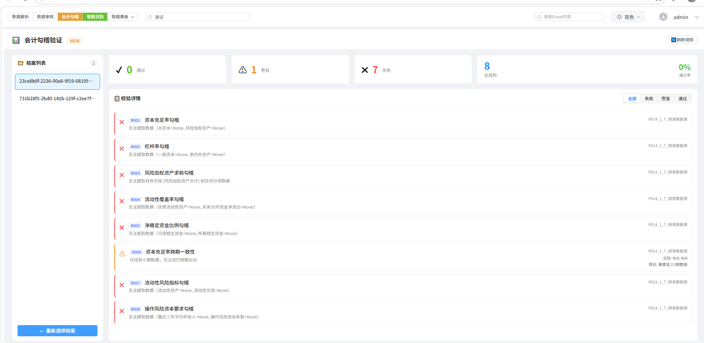

### 6. LLM 智能解析

对扫描件中的复杂表格区域进行框选，由 LLM 智能分析表头结构，辅助人工校正。

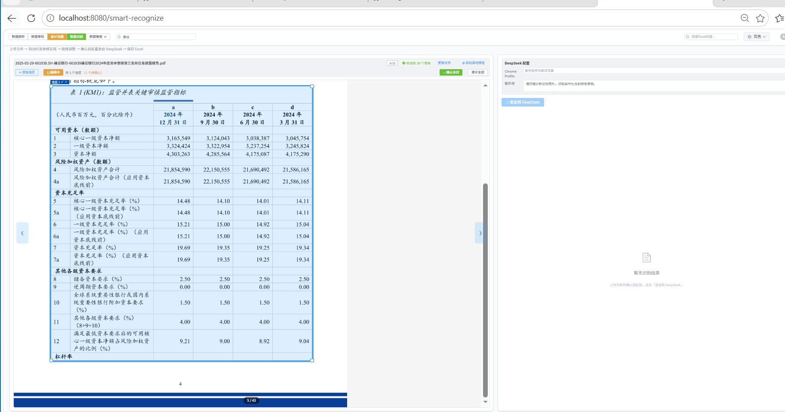

### 7. 数据可视化看板

财务指标趋势分析，原始数据与图表联动，支持穿透查看明细。

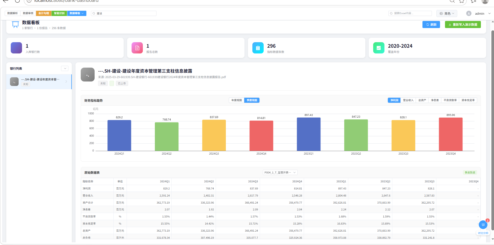

### 8. RAG 智能问答

上传银行年报 PDF → 构建 FAISS 向量索引 → 自然语言提问 → 检索召回相关片段 → LLM 生成答案并标注引用来源。

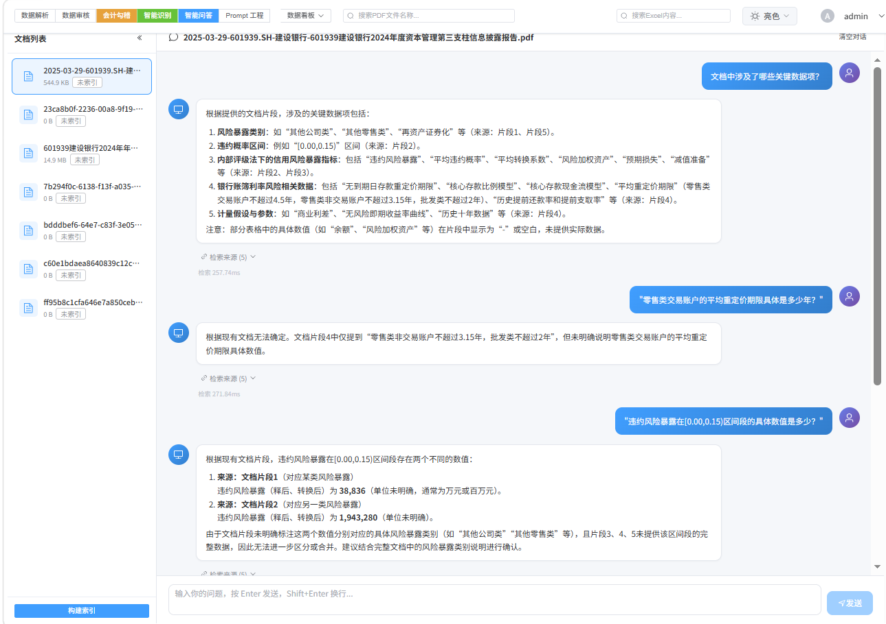

### 9. Prompt 工程设计

针对银行财务表格的复杂性，设计了 5 级评估体系 + 4 种专用 Prompt 模板 + 4 级 JSON 容错策略，确保 LLM 输出的稳定性与准确度。

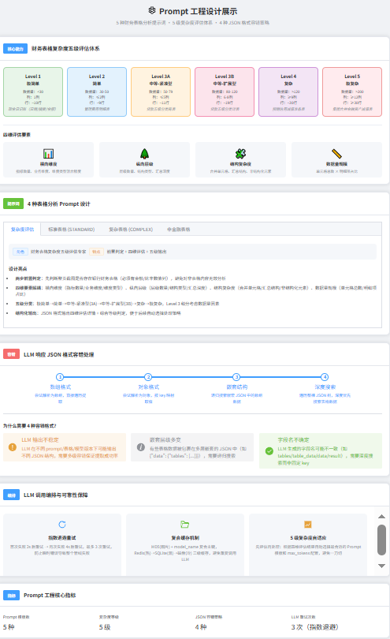

### 10. Agent Harness 编排框架

基于自研 `agent-harness` 框架 (Model + Harness = Agent)，将 OCR、LLM 分析、表格重建、审计、RAG 五大能力统一封装为标准化 Tool。Orchestrator 按 OCR → LLM 分析 → 重建 固定管线自动编排，配合 RuleEngine 验证输出质量，3 次失败自动重试。


---

## 核心技术

### 1. PDF 表格检测 —— 三通道召回 + NMS 融合

```python
# backend/services/table_page_detector.py
bboxes  = []
bboxes += _ch1_yolo(pdf_path, dpi)       # YOLOv8 视觉检测 (cls=0: table)
bboxes += _ch2_lines(pdf_path)            # pdfplumber 横/竖线外接矩形
bboxes += _ch3_text_cluster(pdf_path)     # 文本块 y 中心聚行 + x 中心聚列
# → NMS (IoU=0.2) → 并集合并 (召回优先)
```

| 通道 | 技术 | 场景 | 特点 |
|------|------|------|------|
| **YOLOv8** | 目标检测 | 有线框表格 | 视觉特征 |
| **线条检测** | pdfplumber | 规则表格 | 高精度矩形 |
| **文本聚类** | 字符坐标统计 | 无框线表格 | 启发式 heuristic |

---

### 2. OCR → LLM → 重构 端到端管线

**TableReconstructionPipeline** (backend/core/table_processor/)


**LLM 提示词工程亮点**：
- 多级表头路径生成：`"2024年>>12月31日"` 支持任意层级
- 币种/单位自动推断：从表格上下文提取 default_currency / default_unit
- 响应格式容错：4种 JSON 格式自动探测（数组/对象/嵌套/深度搜索）
- 限流重试：指数退避 (2s→4s)，3次重试

**8 步重构流程** (table_rebuilder.py, ~2400 行)：

| 步骤 | 名称 | 核心算法 |
|------|------|----------|
| 0 | 引用修正 | 确保 LLM 引用的 OCR 表格存在有效数据 |
| 1 | 数据准备 | 直通 |
| 2 | 表格提取 | 分离 OCR 单元格和 LLM 结构 |
| 3 | OCR 合并 | 多子表合并 + 表格边界记录 |
| 4 | 基础表格 | 行列一致性检查 |
| 5 | **列标题 + 列数匹配** | **三级降级策略**（见下文）|
| 6 | 行标题匹配 | 智能相似度 + 层级关系推理 |
| 7 | 行表头合并 | 左侧连续空表头列合并 |
| 8 | 数据标记 | 5 类单元格类型分析 |

---

### 3. 列数匹配 —— 三级降级策略

当 OCR 列数 > LLM 列数时，逐步尝试：

```
Primary: 空列检测
  └── 遍历 20 行，标记"None + 无中文 + 无数字"的列
  └── 优先删除右侧空列

Fallback 1: OCR Span 分析
  └── 统计每列被不同 OCR cell 的 span 覆盖次数
  └── 覆盖次数最多 + 独立值最少的列 → 冗余列

Fallback 2: 全 None 列 / 完全重复列对
  └── 兜底策略，保证至少能定位一列

LLM 列数 > OCR 列数: 左侧补充 None 列
```

---

### 4. 会计勾稽引擎 (backend/services/audit_engine.py)

**1317 行无外部依赖的纯 Python 校验引擎**，3 类规则规则所有银行财务指标：

| 规则类型 | 校验方法 | 容差 | 典型场景 |
|----------|---------|------|----------|
| **formula** | 计算值 = (分子/分母) × multiplier | 百分比/绝对值 | 资本充足率、杠杆率 |
| **sum_check** | 分项求和 vs 合计值 | 绝对值 (默认1000) | 流动覆盖率、风险加权资产 |
| **periodicity** | 跨期差值 vs 容差 | 绝对值 (默认0.5) | 跨期一致性校验 |

**智能行列定位**：
- 行匹配：评分制（精确=100分，包含=10分），从 B 列开始防误匹配
- 列匹配：日期列用 `_find_period_date_col` 智能判断 Row3 偏移
- 数据提取：向下回退 5 行 + 向右偏移 5 列双重容错
- 数值解析：千分位逗号、括号负数 `(123)→-123`、百分比

---

### 5. 多级缓存架构

```
┌──────────┐   ┌──────────┐   ┌──────────┐
│ Redis    │ ← │ SQLite   │ ← │ 磁盘文件  │
│ (热)     │   │ (温)     │   │ (冷)     │
└──────────┘   └──────────┘   └──────────┘
     ↑              ↑              ↑
     └────── MD5 哈希键 ────────┘
```

- OCR 结果：三级缓存（Redis → DB → 磁盘），MD5 去重
- LLM 结果：MD5 + model_name 复合主键，压缩存储，过期清理
- 进度状态：内存 + DB + Redis 三同步，WebSocket 实时推送

---

### 6. 数据审核 —— 三策略更新

```python
# backend/api/file_handlers/excel_data_handler.py
Strategy 1: diff-based 精确更新
  └── 前端发送 [{row, col, oldValue, newValue}, ...]
  └── 逐条应用到 Excel，自动 0-based → 1-based 转换

Strategy 2: 完整数据覆盖
  └── 前端发送完整二维数组
  └── 清空目标 Sheet → 写入新数据
  └── 自动列数不匹配修复 (fill_column_mismatch)

Strategy 3: 回退保护
  └── 两种策略都失败时返回错误，不破坏原文件
  └── 编辑前自动保存 JSON 快照
```

---

### 7. 数据库 —— 适配器模式 + 统一入口

```
UnifiedDatabaseManager (Facade)
  ├── OldDatabaseManagerAdapter    ← 旧版 SQLite 兼容
  ├── NewDatabaseManagerAdapter    ← 新版表格处理表
  ├── FileUploadServiceAdapter     ← 文件上传
  └── FileManagementServiceAdapter ← 文件管理
```

设计目标：多版本数据库共存，迁移期间不中断服务。

---

### 8. 表格检测筛选 —— 传统 CV + 可配置阈值

```
TraditionalTableDetector
  ├── Hough 变换提取横/竖线
  ├── 轮廓文字密度分析
  ├── 三分类: HAS_TABLE / NO_TABLE / UNCERTAIN
  └── 可配置置信度阈值 (high=0.7, low=0.3)
```

---

### 9. RAG 智能问答管线

完整向量检索+生成链路，支持流式输出与多轮对话记忆：

```
PDF文档 ──→ PyMuPDF提取文本 ──→ 语义分块(512字/128重叠)
                                         │
                                    BGE-large-zh (1024-dim)
                                         │
                                    FAISS IndexIVFFlat
                                     (IVF聚类, nlist自适应)
                                         │
  用户提问 ──→ 查询向量化 ──→ Top-K 检索 ──→ 拼接上下文
                                                 │
                                           DeepSeek 生成
                                          (SSE 流式输出)
                                                 │
                                         标注引用来源 + 相似度
```

**关键配置**：

| 组件 | 参数 | 说明 |
|------|------|------|
| 分块策略 | 512 字符 + 128 overlap | 语义边界切分，避免截断 |
| 向量模型 | BGE-large-zh | 中文优化，支持 query/passage 双编码 |
| 向量维度 | 1024 | native float32，归一化后内积检索 |
| FAISS 索引 | IndexIVFFlat | IVF 聚类，nlist/2 自适应（最少 125） |
| 检索 | nprobe=16, Top-K=5 | 搜索 16/125 个聚类，召回 5 个片段 |
| 生成 | DeepSeek (OpenAI 兼容) | temperature=0.3, 2K tokens |
| 流式 | SSE (Server-Sent Events) | token-level 实时推送 |
| 对话记忆 | 最近 10 轮 | session_id 隔离，支持清除历史 |
| 引用标注 | [片段N] + 相似度 | 每个回答附带检索来源 |

```python
# backend/services/rag_service.py
class RagPipeline:
    def query_with_answer(self, question, top_k=5, session_id=""):
        # 1. 向量检索
        query_vec = self.embedder.encode_query(question)  # BGE query prefix
        results = self.index_mgr.search(query_vec, k=top_k)
        
        # 2. 构建上下文 + 来源
        context = "\n".join(f"[片段{i+1}] {r['text']}" for i, r in enumerate(results))
        sources = [{"index": i+1, "source": r["source"], "similarity": r["score"]}
                   for i, r in enumerate(results)]
        
        # 3. LLM 生成 (流式 SSE)
        for line in self.generate_answer_stream(question, context, sources, session_id):
            yield line  # data: {"type":"token","content":"..."}
```

---

### 10. Agent Harness 编排层 —— Model + Harness = Agent

自研零外部依赖的轻量级 Agent 框架，将能力模块统一包装为 Tool，由 Orchestrator 编排调度：

```
                    agent-harness 框架
          ┌─────────────────────────────────┐
          │  ToolRegistry   ←── 5 Tools ──┐ │
          │  Agent          ←── think→act │ │
          │  Orchestrator   ←── 编排+验证  │ │
          │  RuleEngine     ←── 3 Rules   │ │
          └─────────────────────────────────┘
                         │
          ┌──────────────┼──────────────┐
          ▼              ▼              ▼
     ┌─────────┐  ┌──────────┐  ┌──────────┐
     │  OCR    │  │ LLM分析  │  │ 表格重建  │
     │  Tool   │→ │  Tool    │→ │  Tool    │
     └─────────┘  └──────────┘  └──────────┘
          │              │              │
          └── TableParsingAgent ───────┘
              (固定管线, max_retries=3)
```

**关键设计**：

| 组件 | 作用 | 说明 |
|------|------|------|
| `Tool` / `ToolResult` | 能力单元统一抽象 | `execute()` 接口 + `success/data/error/retry_count` |
| `ToolRegistry` | 工具注册中心 | register / get / list_all |
| `Agent` | Agent 基类 | think → act → observe 循环，内置重试机制 |
| `Orchestrator` | 多 Agent 编排器 | 约束→执行→验证→纠错→收敛 |
| `RuleEngine` | 可插拔验证规则 | NotNullRule / ColumnConsistencyRule / TableCountRule |

**API 端点**：

| 端点 | 方法 | 功能 |
|------|------|------|
| `/api/harness/tools` | GET | 列出所有已注册 Tool |
| `/api/harness/parse` | POST | Agent 驱动的端到端表格解析 |
| `/api/harness/rag` | POST | RAG 智能问答（Agent 调度） |

```python
# backend/api/harness_routes.py
@harness_bp.route("/parse", methods=["POST"])
def agent_parse():
    agent = TableParsingAgent()        # 持有 OCR + LLM + Rebuild 三个 Tool
    orchestrator = Orchestrator(       # 编排器
        agent=agent,
        rules=[NotNullRule(), ColumnConsistencyRule(), TableCountRule()]
    )
    result = orchestrator.run(image_path=data["image_path"])
    return result.to_dict()
```

---

## 架构全景

```
┌─────────────────────────────────────────────────────┐
│                   Vue 3 + Element Plus               │
│    数据解析  │  数据审核  │  会计勾稽  │  智能识别   │
└──────────────────────┬──────────────────────────────┘
                       │ REST API / WebSocket
┌──────────────────────┴──────────────────────────────┐
│                   Flask Backend                      │
│                                                      │
│  ┌────────────────────────────────────────────────┐  │
│  │          15+ API Blueprints                     │  │
│  │  upload  file  convert  audit  llm  smart       │  │
│  │                harness  (Agent编排)             │  │
│  └────────────────────────────────────────────────┘  │
│                                                      │
│  ┌────────────────────────────────────────────────┐  │
│  │           Agent Harness 编排层                  │  │
│  │  Tool(5) → Agent → Orchestrator → RuleEngine  │  │
│  └────────────────────────────────────────────────┘  │
│                                                      │
│  ┌──────────┐ ┌──────────┐ ┌──────────────────────┐ │
│  │  Service  │ │  Core    │ │  Database (Facade)   │ │
│  │  Layer    │ │ Pipeline │ │  Old / New / File    │ │
│  └──────────┘ └──────────┘ └──────────────────────┘ │
│                                                      │
│  ┌────────────────────────────────────────────────┐  │
│  │  Queue: Redis + Worker (多进程并行PDF转换)     │  │
│  └────────────────────────────────────────────────┘  │
└──────────────────────────────────────────────────────┘
```

---

## 技术栈全景

| 层 | 技术 | 用途 |
|------|------|------|
| **前端框架** | Vue 3 + Pinia + Vue Router | SPA + 状态管理 + 路由守卫 |
| **UI 组件** | Element Plus + ECharts 6 | 界面组件 + 数据可视化 |
| **表格编辑** | Handsontable | 类 Excel 在线编辑 |
| **后端框架** | Python 3.11 + Flask 3 + SQLAlchemy 2 | REST API + WebSocket + ORM |
| **PDF 解析** | PyMuPDF + pdfplumber | 文字型 PDF 坐标提取 |
| **OCR** | 百度 OCR / PaddleOCR | 扫描件文字识别 |
| **视觉检测** | YOLOv8 + OpenCV | 表格区域检测 |
| **Embedding** | BGE-large-zh + sentence-transformers | 文本向量化（1024 维） |
| **向量检索** | FAISS (IndexIVFFlat) | IVF 聚类索引，nprobe 自适应 |
| **RAG 生成** | DeepSeek API (OpenAI 兼容) | 检索增强生成 + SSE 流式输出 |
| **表格解析 LLM** | 火山引擎 ARK (豆包 Vision) | 表头结构分析、表格重构 |
| **任务队列** | Redis | 异步任务队列 |
| **数据库** | SQLite + Redis | 持久化 + 缓存 |
| **缓存策略** | Redis(热) → SQLite(温) → 磁盘(冷) | 三级缓存，MD5 + model 复合键 |
| **Agent 框架** | agent-harness (自研) | Tool 包装 + Orchestrator 编排 + RuleEngine 验证 |

---

## 🔬 算法细节

### 表头相似度计算

```
calculate_similarity_v2(text1, text2):
  完全相等 → 1.0
  包含关系且覆盖率 > 80% → 0.9
  包含关系且覆盖率 ≤ 80% → 0.2  ← 防过匹配
  Jaccard 相似度 (字符集合) → 0~1
```

### 动态匹配阈值

```
短文本 (≤3字符):  阈值 = 0.9
中等文本 (≤10):   阈值 = 0.7
长文本 (>10):     阈值 = 0.6
```

### 单元格类型 5 类分类

```
blank     → 无内容
text      → 纯文本（不含数字）
std_num   → 标准数值格式（千分位正确）
minor_num → 小问题数值
error_num → 错误数值（逗号在%前、多负号等）
```

---

## 快速启动

```bash
# 后端
cd backend
pip install -r requirements.txt
python app.py                # 默认 http://localhost:5000

# 前端
cd frontend
npm install
npm run serve                # 默认 http://localhost:8080
```

**演示模式**：前端已内置演示模式，启动后无需登录即可自动进入系统，拥有完整管理权限。可直接上传 PDF 测试解析流程，或通过 Dashboard 的「写入演示数据」按钮一键加载 12 家银行 2020-2024 年的示例数据。

---

## License & Author

独立开发，全栈交付。由真实银行数据处理需求驱动，从桌面原型（PyQt5）到 Web 服务（Vue 3 + Flask）两阶段演进。

- **作者**：高玉伟
- **7 年 NLP/AI 全栈研发** | 5 项授权发明专利 (4 项第一发明人)
- **专长**：MoE 架构、vLLM 推理优化、Qwen 微调、自定义损失函数、PDF 表格提取

