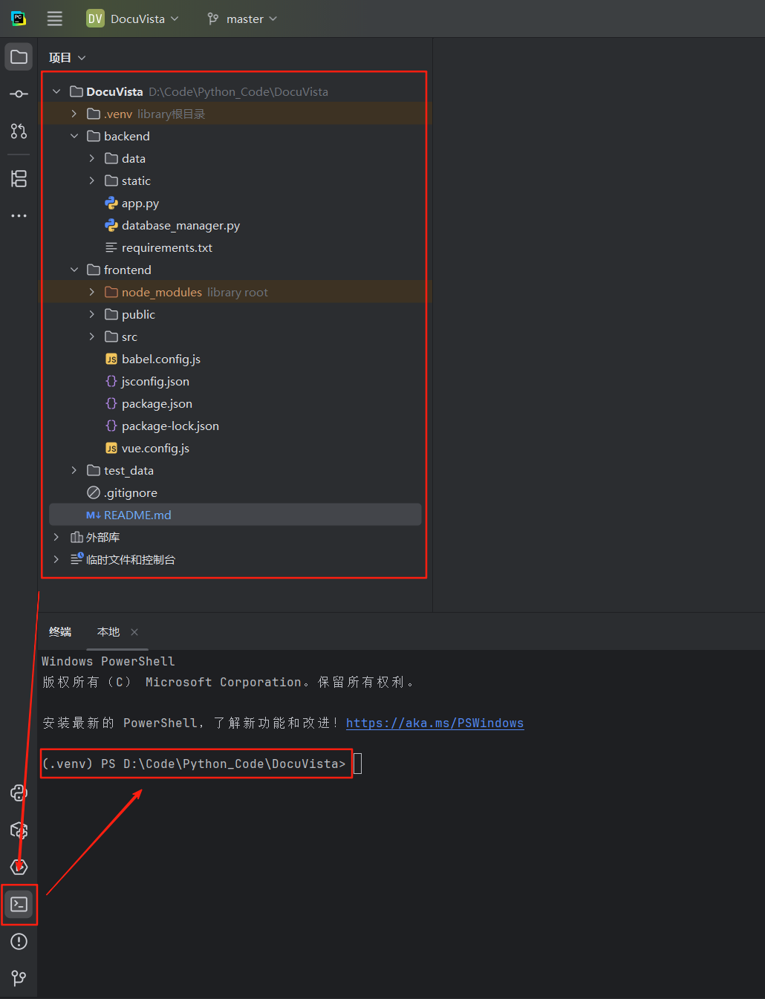
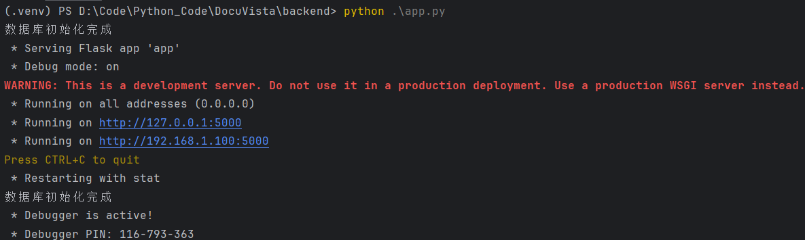
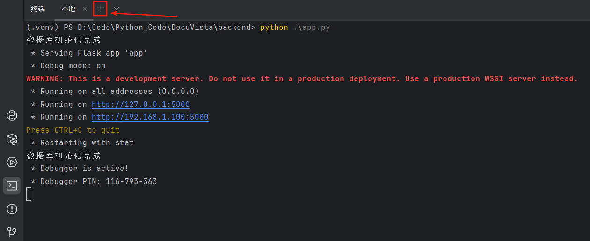
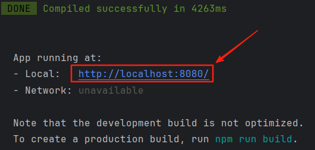
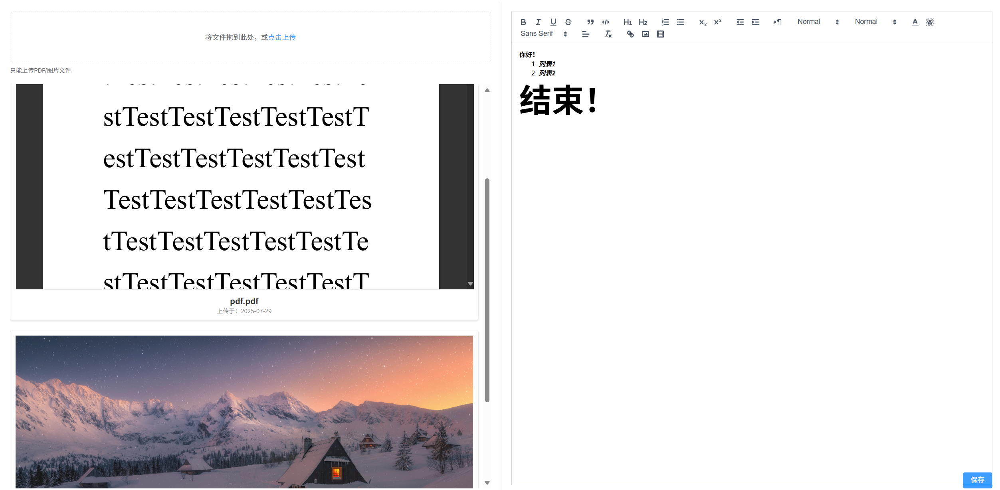
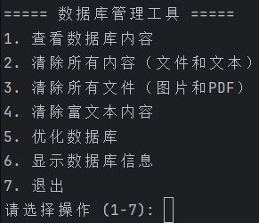

# 一、项目概述
该项目是一个支持上传PDF/图片并编辑富文本内容的文档管理系统，采用前后端分离架构，前端使用Vue.js+Element UI，后端使用Python Flask+SQLite数据库。系统提供文件管理、富文本编辑和内容保存功能。

# 二、项目结构
- backend：后端代码，处理文件上传、数据库和API逻辑
  - data：存放SQLite数据库文件
  - static：存储用户上传的PDF/图片文件
  - app.py：Flask后端主程序，提供RESTful API
  - database_manager.py：数据库管理工具脚本
  - requirements.txt：项目所需要的依赖包
- frontend：Vue.js前端项目，实现用户界面
  - public：存放静态资源如网站图标和HTML入口
  - src：前端源码，含组件、样式和配置文件
- test_data：示例文件，用于测试

# 三、使用方法
## 3.1 使用前准备
### 3.1.1 安装并配置Node.js
请参考：[Node.js的安装与配置](https://zhuanlan.zhihu.com/p/7314838716)，按照参考链接进行操作即可完成Node.js的安装与配置
### 3.1.2 安装并配置Python
请参考：[Python的安装与配置（只需要关注“Python的安装与环境配置”章节即可）](https://blog.csdn.net/sensen_kiss/article/details/141940274)，选择对应的系统版本进行安装与配置。注意：不需要看IDE的安装与配置，只需要关注Python的安装与配置即可
### 3.1.3 安装并配置Pycharm
请参考：[Pycharm的安装与配置（只需要关注“Python的使用（通过IDE进行使用）”章节即可）](https://blog.csdn.net/sensen_kiss/article/details/141940274)，选择对应的系统版本进行安装与配置。注意：不需要看Python的安装与配置，只需要关注IDE的安装与配置即可
### 3.1.4 使用Pycharm打开项目
使用安装与配置好的Python环境与Pycharm环境打开给您的项目。注意：打开项目后需要按照图片步骤打开终端，后续需要使用
<div align="center">
  
</div>

## 3.2 具体用法
1. 注意：后续涉及到的命令行执行的步骤均在终端中执行，即“3.1.4 使用Pycharm打开项目”章节中介绍的终端
2. 创建并激活Python虚拟环境
``` python
python -m venv venv
.\venv\Scripts\activate
```
2. 安装后端相关依赖包
``` shell
cd .\backend\
pip install -r requirements.txt
cd ..
```
2. 安装前端相关依赖包
``` shell
cd .\frontend\
npm install
cd ..
```
3. 然后启动后端
```shell
cd .\backend\
python .\app.py
```
4. 出现如下图所示的内容，即代表后端启动成功
<div align="center">
  
</div>

5. 然后打开一个新的终端
<div align="center">
  
</div>

6. 然后启动前端
```shell
cd .\frontend\
npm run serve
```

7. 出现如下图所示的内容，即代表前端启动成功，此时可以点击红框和红箭头处所示的链接进入网站主页
<div align="center">
  
</div>

8. 出现如下图所示的内容即代表项目部署成功
<div align="center">
  
</div>

9. 同时，您还可以使用数据库管理工具来管理数据库中的数据，可以使用下面的命令来启动数据库管理工具
```shell
cd .\backend\
python .\database_manager.py
```

10. 通过数据库管理工具，您可以查看数据库中的数据信息，以及删除相关信息
<div align="center">
  
</div>
