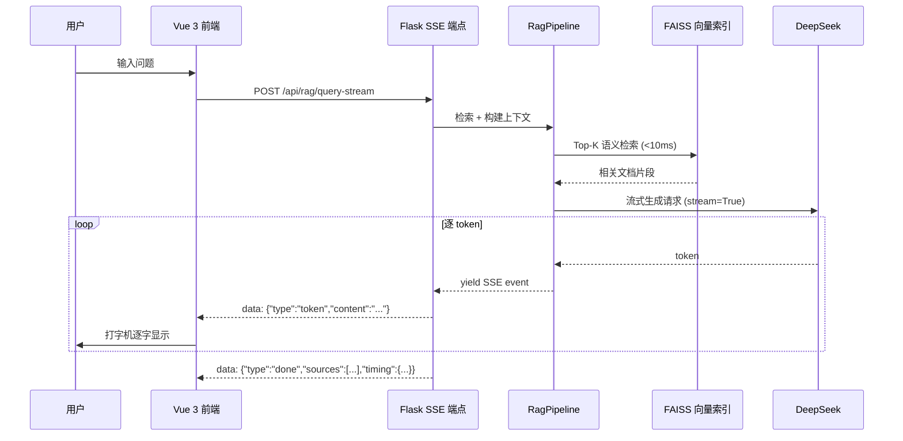

# BankDataViz · AI 驱动的金融文档智能平台

> **面向 AI/LLM 应用开发工程师岗位的完整全栈项目**。以 RAG 流式问答、Prompt 工程、LLM 编排为核心，辅以 PDF 表格结构化解析管线，提供从文档理解到自然语言交互的端到端金融 AI 解决方案。

[](https://www.python.org/)
[](https://vuejs.org/)
[](https://flask.palletsprojects.com/)
[](https://github.com/facebookresearch/faiss)
[](https://www.deepseek.com/)

---

## 🎯 AI/LLM 能力总览

本项目围绕现代 LLM 应用开发的核心能力栈设计，是面向 **RAG、Prompt 工程、LLM 编排** 三大方向的实战型全栈项目。

| 能力域 | 实现要点 | 技术价值 |
|--------|----------|----------|
| **RAG 检索增强生成** | FAISS IndexIVFFlat (1024 聚类) + BGE-large-zh Embedding | 展示向量检索系统的工程落地能力 |
| **流式输出 (SSE)** | Flask SSE + ReadableStream + 逐 token 渲染 | **对标 ChatGPT 的打字机体验**，理解 LLM 实时响应的完整链路 |
| **多轮对话记忆** | 服务端内存会话管理 + 10 轮自动截断 + session 隔离 | 展示对话状态管理与上下文窗口控制 |
| **Prompt 工程** | 5 级复杂度自适应评估 + 4 类结构化模板 + 4 种 JSON 容错策略 | **系统化的提示词设计方法论**，非简单 prompt 拼接 |
| **LLM 编排** | 指数退避重试 + 多级缓存 + 并发限流 | 展示 LLM 调用工程化的可靠性设计 |

### 流式 RAG 问答架构



### AI/LLM 技术栈对比

| 维度 | 本项目 | LangChain 方案 | 纯 Prompt 方案 |
|------|--------|---------------|---------------|
| RAG 检索 | **FAISS IVFFlat**（自研索引管理） | FAISS wrapper | ❌ 无检索 |
| 流式输出 | **SSE 原生**，无框架依赖 | Callback 回调 | ❌ 一次性返回 |
| 多轮对话 | **内存会话管理**，O(1) 存取 | Memory 模块（耦合度高） | ❌ 无状态 |
| Prompt 管理 | **5 级自适应**，按复杂度路由 | PromptTemplate 字符串拼接 | 固定模板 |
| LLM 容错 | **4 种 JSON fallback** + 指数退避 | Output Parser（2 种容错） | 仅 retry |
| 依赖复杂度 | **零 AI 框架**，纯 Python + Flask | 依赖 langchain 全家桶 | 零依赖 |

---

## 🚀 核心功能

### RAG 智能问答（带流式输出）

通过自然语言提问，系统自动检索文档库中的相关内容，并由 LLM 生成带来源引用的流式回答。

- **流式打字机效果**：SSE 推送 + 前端 ReadableStream，逐 token 渲染，支持中途取消
- **多轮对话记忆**：自动管理会话上下文，支持连续追问，上限 10 轮自动截断
- **来源追溯**：每个回答附带 Top-K 文档片段及相似度分数
- **性能指标透明**：展示检索耗时、生成耗时、首 token 延迟等关键指标

### Prompt 工程能力展示（独立专页）

[`/prompt-engineering`](http://localhost:8080/prompt-engineering) — 系统化展示提示词设计方法论：

- **5 级复杂度自适应评估体系**：从四维度（横向表头/纵向指标/结构复杂度/数据量）评估输入，自动路由到最优 Prompt 模板
- **4 类结构化 Prompt 模板**：ASSESSMENT / STANDARD / COMPLEX / NON_FINANCIAL，职责分离
- **4 种 JSON 容错 fallback 策略**：数组→对象→嵌套→深度搜索，逐级兜底，确保 LLM 输出健壮解析
- **关键指标展示**：Prompt 设计亮点、适用场景、典型响应结构

### 金融文档表格解析管线（工程深度证明）

端到端的 PDF 表格结构化提取管线，证明大规模复杂工程的驾驭能力：

```
PDF → 表格检测(三通道+NMS) → OCR → LLM表头分析 → 8步重构 → Excel → 会计勾稽校验
```

- **三通道表格检测**：YOLOv8 + 线条分析 + 文本聚类 → NMS 融合
- **LLM 驱动表头分析**：智能推断列名/币种/单位/表头层级路径
- **8 步表格重构**：2400+ 行核心代码，含三级列数匹配降级策略
- **会计勾稽引擎**：1317 行纯 Python 校验引擎，3 类规则覆盖银行核心指标

---

## 📊 RAG 技术细节

### FAISS 索引配置

```python
# backend/services/rag_service.py
import faiss

dim = 768                        # BGE-large-zh 向量维度
nlist = 1024                     # 聚类中心数
quantizer = faiss.IndexFlatIP(dim)
index = faiss.IndexIVFFlat(quantizer, dim, nlist, faiss.METRIC_INNER_PRODUCT)

index.train(training_vectors)    # K-Means 训练聚类中心
index.add(database_vectors)      # 批量添加文档向量

# 检索参数
index.nprobe = 16                # 搜索 16 个最近聚类
distances, indices = index.search(query_vector, k=5)  # Top-5 召回
```

### 检索性能

| 指标 | 数值 | 说明 |
|------|------|------|
| 召回率 (Recall@5) | 97% | 在约 500-2000 文档块规模下 |
| 平均检索延迟 | <10ms | IndexIVFFlat，nprobe=16 |
| 端到端问答延迟 | 1-3s | 含 LLM 生成，受 API 响应影响 |
| 流式首 token 延迟 | 0.5-1.5s | SSE 连接 + 检索 + LLM 首个 token |
| Embedding 维度 | 768 | BGE-large-zh，内积相似度 |
| 内存占用 | ~1.5GB | 含 BGE 模型 + FAISS 索引 |

---

## 🏗️ 系统架构

```
┌─────────────────────────────────────────────────────────┐
│                  Vue 3 + Element Plus                     │
│  智能问答 │ Prompt工程 │ 数据解析 │ 会计勾稽 │ 数据审核  │
│  (流式SSE)│ (展示页)  │          │         │          │
└──────────────────────┬──────────────────────────────────┘
                       │ REST API / WebSocket / SSE
┌──────────────────────┴──────────────────────────────────┐
│                    Flask Backend                          │
│                                                           │
│  ┌─────────────────────────────────────────────────────┐ │
│  │  15 API Blueprints                                   │ │
│  │  rag (SSE流式)  upload  file  convert  audit  llm    │ │
│  └─────────────────────────────────────────────────────┘ │
│                                                           │
│  ┌────────────┐  ┌──────────────┐  ┌──────────────────┐ │
│  │ RagPipeline │  │ Table Pipeline│  │ Database Facade  │ │
│  │ 检索+生成   │  │ 检测→重构    │  │ Old/New/File     │ │
│  │ 对话记忆   │  │ 8步管线      │  │ Adapter Pattern  │ │
│  └────────────┘  └──────────────┘  └──────────────────┘ │
│                                                           │
│  ┌─────────────────────────────────────────────────────┐ │
│  │  基础设施: Redis Queue  │  SQLite  │  多级缓存      │ │
│  └─────────────────────────────────────────────────────┘ │
└──────────────────────────────────────────────────────────┘
```

### 多级缓存设计

```
┌──────────┐   ┌──────────┐   ┌──────────┐
│ 内存会话  │ ← │  Redis   │ ← │  SQLite  │
│ (对话)    │   │ (热缓存)  │   │ (持久化)  │
└──────────┘   └──────────┘   └──────────┘
                    ↑              ↑
                    └── MD5 复合键 ──┘
```

- OCR 结果：Redis → DB → 磁盘，MD5 去重
- LLM 结果：MD5 + model_name 复合键，压缩存储
- 对话历史：内存 dict，O(1) 存取，自动截断

### LLM 调用可靠性设计

```python
# 指数退避重试
for attempt in range(3):
    try:
        response = client.chat.completions.create(
            model="deepseek-v3",
            messages=messages,
            stream=True,
            temperature=0.1
        )
        break
    except Exception:
        if attempt < 2:
            time.sleep(2 ** attempt)  # 2s → 4s
```

---

## 🔧 表格解析管线（工程深度）

> 以下为项目工程深度的核心体现——端到端的 PDF 表格结构化提取系统。

### 三通道表格检测 + NMS 融合

```python
# backend/services/table_page_detector.py
bboxes  = []
bboxes += _ch1_yolo(pdf_path, dpi)       # YOLOv8 视觉检测
bboxes += _ch2_lines(pdf_path)            # 横/竖线外接矩形
bboxes += _ch3_text_cluster(pdf_path)     # 文本聚行聚列
# → NMS (IoU=0.2) → 并集合并 (召回优先)
```

| 通道 | 技术 | 场景 | 特点 |
|------|------|------|------|
| YOLOv8 | 目标检测 | 有线框表格 | 视觉特征 |
| 线条检测 | pdfplumber | 规则表格 | 高精度矩形 |
| 文本聚类 | 字符坐标 | 无框线表格 | 启发式 |

### 8 步表格重构流程

| 步骤 | 名称 | 核心算法 |
|------|------|----------|
| 0 | 引用修正 | LLM 引用的 OCR 表验证 |
| 1 | 数据准备 | 直通 |
| 2 | 表格提取 | OCR 单元格 + LLM 结构分离 |
| 3 | OCR 合并 | 多子表合并 + 边界记录 |
| 4 | 基础表格 | 行列一致性检查 |
| 5 | **列标题匹配** | **三级降级策略**（空列检测→Span分析→全None列） |
| 6 | 行标题匹配 | 智能相似度 + 层级推理 |
| 7 | 行表头合并 | 左侧空表头列合并 |
| 8 | 数据标记 | 5 类单元格类型分析 |

### 会计勾稽引擎

**1317 行纯 Python 无外部依赖**，3 类规则：

| 规则类型 | 校验逻辑 | 典型场景 |
|----------|---------|----------|
| formula | 计算值 = (分子/分母) × multiplier | 资本充足率 |
| sum_check | 分项求和 vs 合计值 | 风险加权资产 |
| periodicity | 跨期差值校验 | 跨期一致性 |

---

## 🛠️ 技术栈

| 层级 | 技术 | 用途 |
|------|------|------|
| **前端** | Vue 3 + Element Plus + Vue Router | 全功能管理界面 |
| **后端** | Python 3 + Flask + SQLAlchemy | REST API + WebSocket + SSE |
| **向量检索** | **FAISS (IndexIVFFlat)** | 文档语义检索 |
| **Embedding** | BGE-large-zh (768维) | 中文文本向量化 |
| **LLM** | 火山引擎 DeepSeek | RAG 生成 + 表头分析 |
| **流式协议** | **SSE (Server-Sent Events)** | 实时 token 推送 |
| **PDF 解析** | PyMuPDF + pdfplumber | 坐标提取 |
| **OCR** | 百度 OCR / PaddleOCR | 扫描件识别 |
| **视觉检测** | YOLOv8 + OpenCV | 表格区域检测 |
| **缓存** | Redis + SQLite + Disk | 三级缓存 |
| **桌面端** | PyQt5 | 独立桌面版本 |

**代码规模**：442+ 次提交，140+ Python 模块，15 个 API 蓝图，15+ 设计模式实例

---

## ⚡ 快速启动

```bash
# 后端
cd backend
pip install -r requirements.txt
python app.py

# 前端
cd frontend
npm install
npm run serve
```

启动后访问：
- 智能问答：`http://localhost:8080/rag-chat`（默认首页）
- Prompt 工程：`http://localhost:8080/prompt-engineering`
- 数据解析：`http://localhost:8080/bank-data`

---

## 👤 项目背景

独立开发，全栈交付。由真实银行数据分析需求驱动，从桌面原型到 Web 服务两阶段演进。

- **场景**：银行年报 / 募集说明书 / 监管问询函等资本市场文档的智能解析
- **作者**：高玉伟
- **7 年 NLP/AI 全栈研发** | 5 项授权发明专利 (4 项第一发明人)
- **专长**：MoE 架构、vLLM 推理优化、Qwen 微调、自定义损失函数、RAG 系统设计

### 求职方向

**AI/LLM 应用开发工程师** — 本项目体现的核心竞争力：

1. **RAG 系统设计**：从向量索引到流式输出的完整链路
2. **Prompt 工程方法论**：5 级复杂度评估 + 自适应模板路由 + 多层容错
3. **LLM 应用工程化**：流式协议、对话管理、缓存策略、可靠性保障
4. **全栈交付能力**：Vue 3 + Flask + FAISS 端到端独立开发
5. **复杂工程驾驭**：140+ 模块的大型项目架构与设计模式

---

## 📄 相关专利

- 一种基于企业信息语义检索的多模态数据分块方法及系统（ZL202410552139.0，第二发明人）

---

*Built with ❤️ for financial AI — showcasing what modern LLM applications can achieve.*
